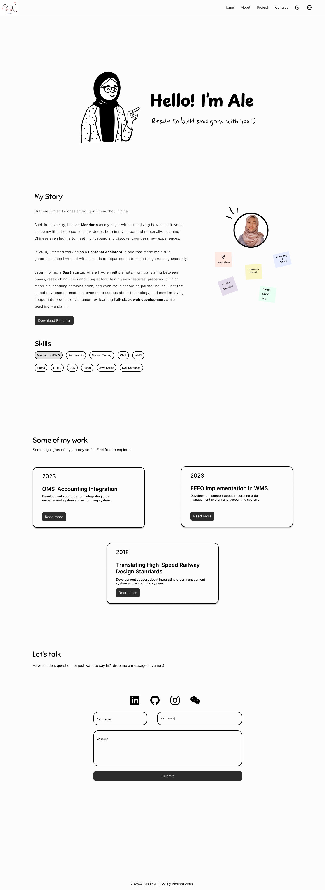

# Hello! I'm Ale🧕🏻

Welcome to Ale's personal website. I'm Indonesian living in China who starting to learn about **full-stack web development**.

This website will be available in **two languages** (English and Chinese) and support **two screen modes** (light and dark).

- View it here: [aletheaalmas.com](https://aletheaalmas.com)
- Design link: [UI Design](https://www.figma.com/design/aKawpdPxNjhOKhaLWvmHaO/aletheaalmas.com?node-id=5-17)

> Note: Website is still in progress

## Built With🩷

This project was initially designed in **Figma** and will continue to be developed using **HTML**, **CSS**, **JavaScript**, and other technologies.

## Features✨

The website will include the following features:

- **Fully Responsive**. Optimized for desktop (_mobile version coming soon_).
- **Dark/Light Mode** (_coming soon_).
- **Animations** (_coming soon_).
- **Contact Form**.

## Website Sections✅

### Hero Section

- Navigation bar with logo, section menu, dark/light mode toggle, and language switcher.
- A clean welcome message introducing my name and tagline:
  > _Hello! I'm Ale_  
  > _Ready to build and grow with you :)_
- An engaging hero animation.

### About Section

- A brief introduction about me.
- Call-to-action button: “Download Resume.”
- Profile picture.
- “Post-it” style animation.
- List of technical skills and proficiencies.

### Projects Section

- Showcase of selected projects from my previous roles.

### Contact Section

- Contact form for direct messages.
- Social and communication links:
  - [Github](https://github.com/aletheaalmas)
  - [LinkedIn](https://www.linkedin.com/in/alethea-almas-146a91108/)
  - [Instagram](https://www.instagram.com/aletheaalmas/)
  - [Wechat](https://drive.google.com/file/d/18VAMxkSPLcEb05tXuDBR6vIacTqDZ3_n/view?usp=sharing)

## Screenshoot

### Home

